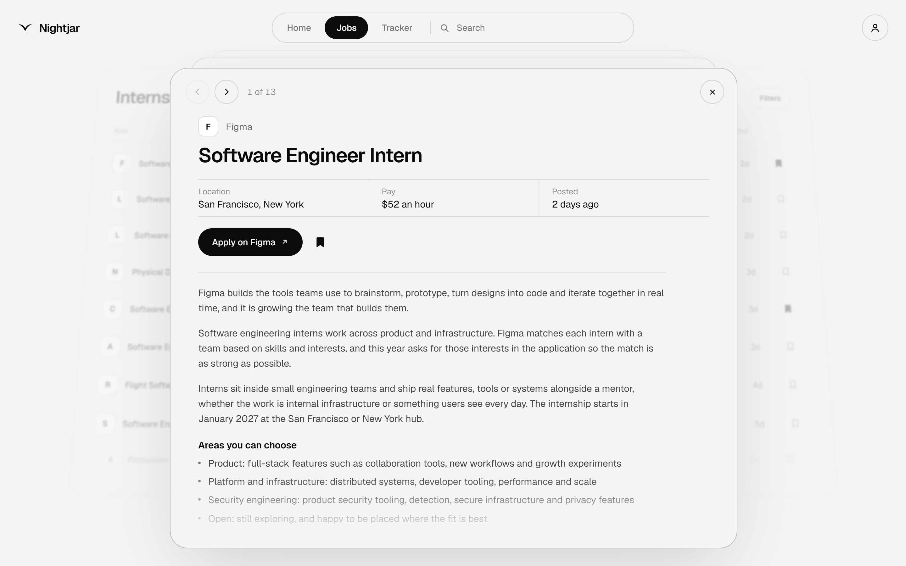
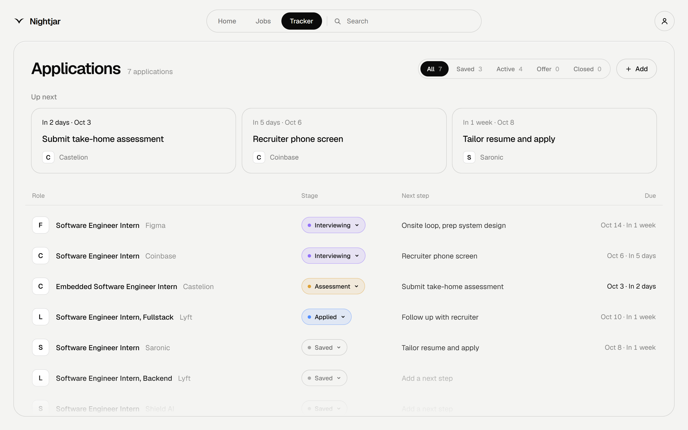
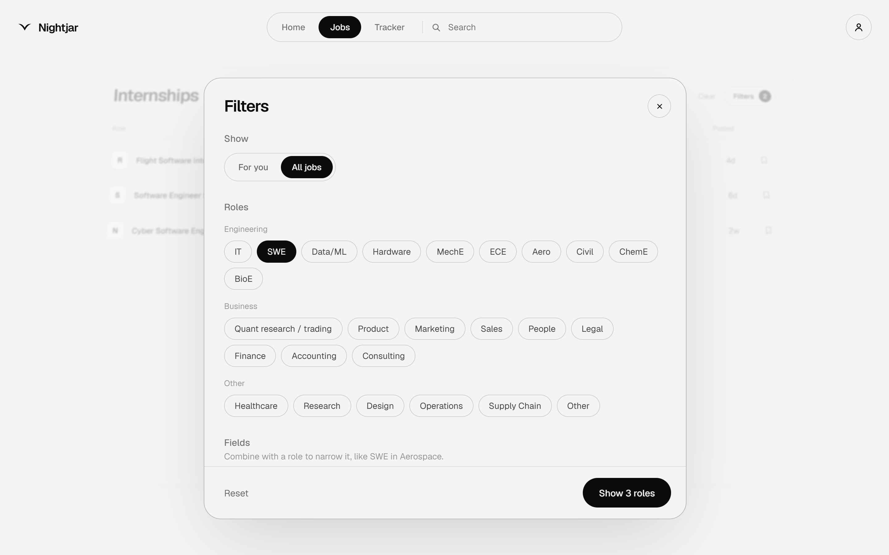
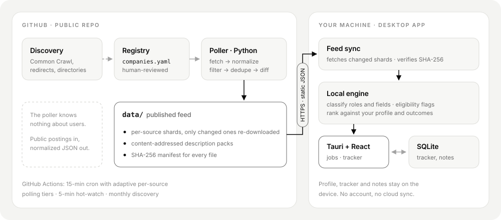

<div align="center">
  

  <h1>Nightjar</h1>

  <p><strong>Internship discovery and application tracking, in one quiet desktop app.</strong></p>
  <p>A self-updating job feed built from company career systems, plus a private,<br />local-first tracker for everything you apply to.</p>

  <p>
    
    
    
    
    <a href="LICENSE"></a>
  </p>

  <p>
    <a href="#features">Features</a> &nbsp;·&nbsp;
    <a href="#how-it-works">How it works</a> &nbsp;·&nbsp;
    <a href="#engineering-notes">Engineering notes</a> &nbsp;·&nbsp;
    <a href="#run-it-locally">Run locally</a> &nbsp;·&nbsp;
    <a href="#your-data">Privacy</a>
  </p>
</div>

<br />



<br />

Internship searches end up spread across dozens of career pages, a few aggregator
lists, browser tabs and a spreadsheet. Nightjar pulls that into one place. A
scheduled poller reads company applicant-tracking systems directly and publishes a
normalized feed. The desktop app filters that feed against your own profile and
keeps your applications on your machine.

## Features

<table>
  <tr>
    <td width="50%" valign="top">
      <h3>Discover</h3>
      <ul>
        <li>One feed of internships, co-ops and new-grad programs, pulled straight from employer job boards</li>
        <li>Full role descriptions inside the app, with a direct link to the original application</li>
        <li>Role and field filters across SWE, hardware, MechE, ECE, aerospace, quant, finance and more</li>
        <li>Original requirements and relevant authorization passages, with incomplete descriptions clearly marked</li>
      </ul>
    </td>
    <td width="50%" valign="top">
      <h3>Track</h3>
      <ul>
        <li>Save a role in one click and move it through stages, from applied to offer</li>
        <li>Next steps, due dates and notes on every application</li>
        <li>Optional interview and outcome logging stored in your local application history</li>
        <li>Workspace export and restore, plus manual entries for roles found elsewhere</li>
      </ul>
    </td>
  </tr>
</table>

<table>
  <tr>
    <td width="50%"></td>
    <td width="50%"></td>
  </tr>
  <tr>
    <td align="center"><sub><b>Tracker:</b> every application, its stage and the next thing to do</sub></td>
    <td align="center"><sub><b>Filters:</b> combine roles with fields, for example SWE + Aerospace</sub></td>
  </tr>
</table>

## How it works

<p align="center">
  
</p>

**The poller knows nothing about any user.** It fetches public postings, applies a
fixed product scope (student and early-career roles in the US), normalizes them to
one schema and publishes static JSON. All personal decisions happen in the app: what
you're eligible for, what fits your interests and how results are ranked.

| Layer | Answers | Where |
| --- | --- | --- |
| Discovery | Which employer job boards exist? | [`poller/discovery`](poller/discovery) |
| Extraction | What is posted on each board right now? | [`poller/sources`](poller/sources) |
| Classification | Is this an internship, co-op or new-grad role, and in which field? | [`poller/filter.py`](poller/filter.py), [`app/src/classify`](app/src/classify) |
| Scheduling | Which sources need to be checked on this run? | [`poller/main.py`](poller/main.py), [`poller/hot_watch.py`](poller/hot_watch.py) |

**Source adapters:** Greenhouse, Lever, Ashby, Workday, SmartRecruiters, iCIMS,
Workable, Recruitee, Teamtailor, BambooHR, Breezy, JazzHR, Pinpoint, Comeet, Google
Careers, Microsoft Careers, USAJOBS, community lists, and a generic JSON-LD / sitemap
extractor for career sites without a supported ATS.

## Engineering notes

A few of the problems that shaped the design:

- **Adaptive polling on a fixed cron.** GitHub Actions starts a run every 15 minutes,
  but each source has its own due time. Sources are sorted into hot, active and quiet
  tiers based on how often their content changes, measured as an EMA over each
  source's poll history. Polling speeds up near a company's usual hiring window and
  backs off out of season. When a run is close to its cost budget, quiet sources are
  deferred, but a source that hasn't been polled in 48 hours is never skipped.
- **Content hashing and conditional requests.** Each source stores a SHA-256 of its
  sorted posting tuples, which catches in-place edits as well as new and removed IDs.
  `ETag` and `Last-Modified` are sent automatically, so unchanged boards cost a `304`.
- **Flapping guard.** A posting is closed only after it has been missing for two
  consecutive runs, so one failed API call can't wipe out a company's listings. A
  company's first successful fetch doesn't mark all of its postings as new.
- **Conservative cross-source dedupe.** The same role often shows up on an aggregator
  and on the employer's own board. Duplicates are merged when the company, fuzzy title
  and location all match. The direct ATS record wins because its URL is the real
  application link. A missed duplicate is only a minor annoyance, while a false merge
  would hide a role for good.
- **Sharded, verifiable feed.** The feed is split into per-source shards and
  content-addressed description packs, all listed in a SHA-256 manifest. The app
  downloads only the shards that changed and rejects any file that doesn't match
  its checksum.
- **Hot-watch mode.** `polling-overrides.yaml` holds auditable, time-limited watches
  for launches you can't miss. Each watch has a required reason, a 5-minute minimum
  interval and a hard 7-day expiry. It runs through a separate workflow that shares
  the main poller's concurrency group and rate limits.
- **Local-first app.** The workspace is SQLite, through the Tauri SQL plugin on
  desktop and `sql.js` in the browser build. Reclassifying the whole feed runs in
  chunks that can be cancelled, which keeps the app responsive. Desktop updates are
  signature-verified, and the app saves a recovery copy before installing.

### Stack

| | |
| --- | --- |
| **Desktop** | Tauri 2 (Rust), React 19, TypeScript, Vite, Tailwind CSS |
| **Storage** | SQLite (Tauri SQL plugin), `sql.js` for the web build |
| **Poller** | Python 3.12, `uv`, strict `mypy`, `ruff`, `pytest` |
| **Infra** | GitHub Actions for polling, discovery, CI and signed releases |

## Get Nightjar

**The first public Windows release is being prepared.** Once it is published,
installers will be available on the [Releases page](https://github.com/skptre/nightjar/releases).

1. Download the Windows `setup.exe` from a published release.
2. Run the installer and open Nightjar.
3. Set your preferences, browse jobs and save your first opportunity.

You don't need a Nightjar account, and you don't need Python, Node.js or Rust to
use the app. Job listings refresh on their own schedule, separate from app releases.
Use Settings to refresh jobs or check for a new version.

> **Early beta:** performance and loading are still being tuned, and clean-install
> and upgrade checks are part of release validation. See the
> [release checklist](docs/beta-release.md) for the current limits.

## Your data

**Your profile, saved jobs, notes and preferences stay on your device.**

- No Nightjar account and no cloud sync of your workspace.
- Backups and diagnostics are exported as local files.
- Cached jobs stay available offline. You need a connection to load new listings.
- Nightjar does not encrypt local data or exported backups.

The app contacts listing sources and GitHub only to download job data and releases.
When you open an application link, you go to the employer's own site.

## Run it locally

<details>
<summary><strong>Desktop app, poller and checks</strong></summary>

### Desktop app

Install Node.js, Rust and the
[Tauri prerequisites](https://v2.tauri.app/start/prerequisites/) for your platform.
Then, from the repository root:

```sh
cd app
npm ci
npm run tauri:dev
```

For browser development, use `npm run dev` instead. To build an installer, run
`npm run tauri:build`. Signed updater builds also need the release signing setup
described in the [release guide](docs/beta-release.md).

### Poller

Requires Python 3.12 and [uv](https://docs.astral.sh/uv/).

```sh
uv sync
make test      # offline suite, no live network calls
make lint      # ruff + mypy --strict
make poll-dry  # run a poll without writing the feed
```

### App checks

```sh
cd app
npm run lint   # tsc --noEmit
npm test       # vitest
npm run build
```

```sh
cd app/src-tauri
cargo test --locked
```

</details>

## Feedback

Found a broken description, an incorrect listing or something that feels slow?
[Open an issue](https://github.com/skptre/nightjar/issues/new/choose) and include
what you were doing, what happened and the app version. Settings has a diagnostics
export that helps. Please leave personal notes and workspace backups out of public
issues.

## License

[MIT](LICENSE) · Copyright 2026 Yash Singh
